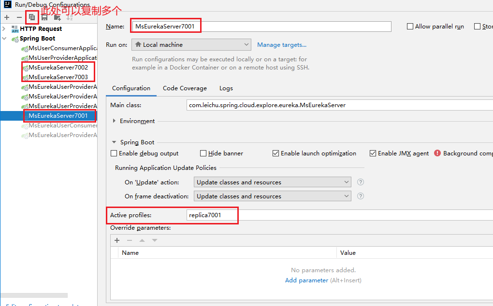
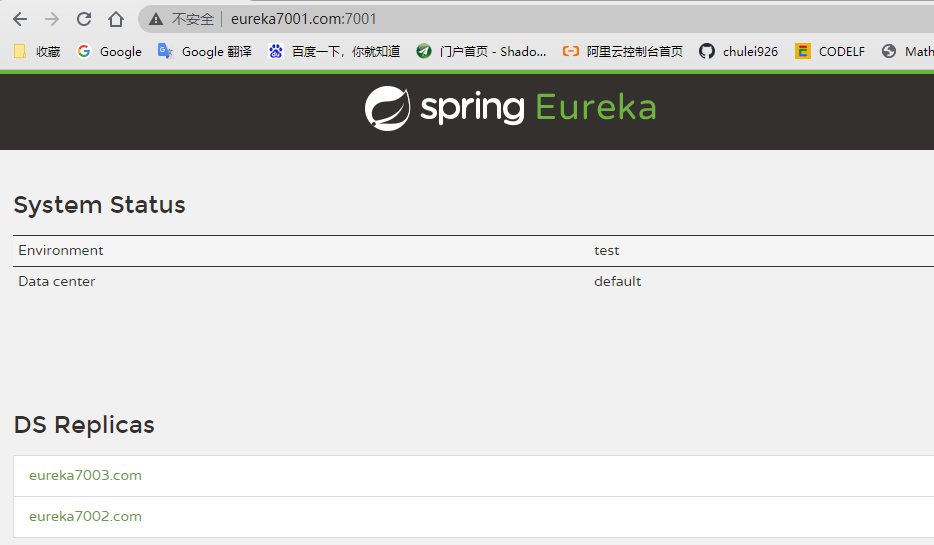
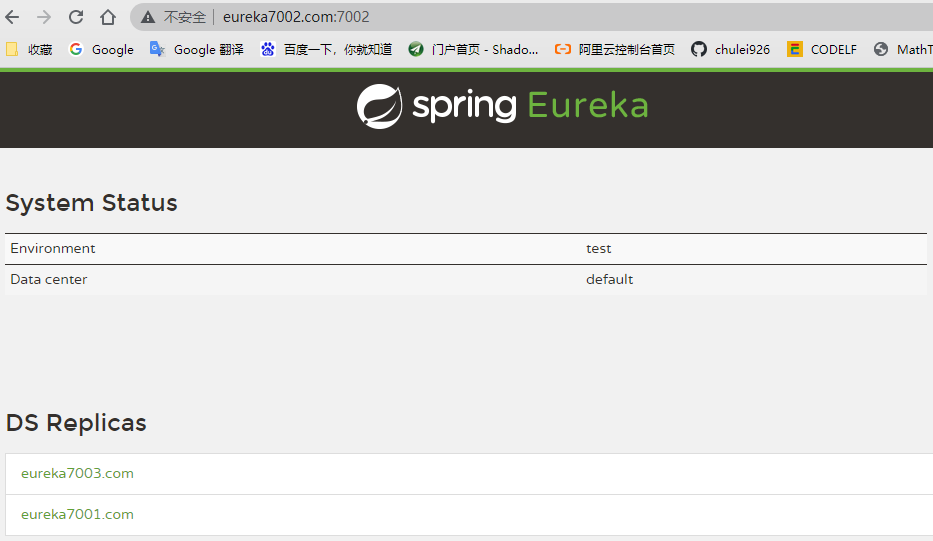
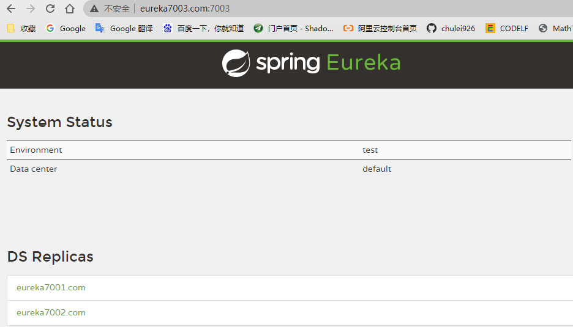
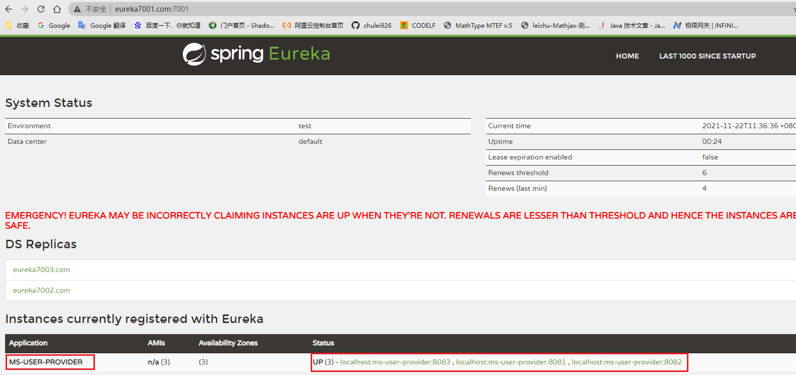

# 注册中心 - Eureka
[微服务注册中心 Eureka 架构深入解读](https://www.infoq.cn/article/jldjq*3wtn2pcqtdyokh)
- Eureka Server
- Eureka Client

## Eureka Server 集群搭建（多节点 **互相注册、相互守望**）
- 引入依赖
```xml
<dependency>
    <groupId>org.springframework.cloud</groupId>
    <artifactId>spring-cloud-starter-netflix-eureka-server</artifactId>
</dependency>
```
- 修改 hosts
```text
127.0.0.1 eureka7001.com
127.0.0.1 eureka7002.com
127.0.0.1 eureka7003.com
```
- yml配置文件
```yaml
# application-replica7001.yml
server:
    port: 7001
eureka:
    instance:
        # hostname: localhost       # eureka服务端的实例名称（单节点）
        hostname: eureka7001.com    # eureka服务端的实例名称（集群）
    client:
        register-with-eureka: false # false表示不向注册中心注册自己。
        fetch-registry: false       # false表示自己端就是注册中心，我的职责就是维护服务实例，并不需要去检索服务
        service-url:
            # defaultZone: http://${eureka.instance.hostname}:${server.port}/eureka/   #设置与Eureka Server交互的地址查询服务和注册服务都需要依赖这个地址。（单节点）
            defaultZone: http://eureka7002.com:7002/eureka/,http://eureka7003.com:7003/eureka/ #设置与Eureka Server交互的地址查询服务和注册服务都需要依赖这个地址。（集群）

# application-replica7002.yml
server:
    port: 7002
eureka:
    instance:
        # hostname: localhost       # eureka服务端的实例名称（单节点）
        hostname: eureka7002.com    # eureka服务端的实例名称（集群）
    client:
        register-with-eureka: false # false表示不向注册中心注册自己。
        fetch-registry: false       # false表示自己端就是注册中心，我的职责就是维护服务实例，并不需要去检索服务
        service-url:
            # defaultZone: http://${eureka.instance.hostname}:${server.port}/eureka/   #设置与Eureka Server交互的地址查询服务和注册服务都需要依赖这个地址。（单节点）
            defaultZone: http://eureka7001.com:7001/eureka/,http://eureka7003.com:7003/eureka/ #设置与Eureka Server交互的地址查询服务和注册服务都需要依赖这个地址。（集群）

# application-replica7003.yml
server:
    port: 7003
eureka:
    instance:
        # hostname: localhost       # eureka服务端的实例名称（单节点）
        hostname: eureka7003.com    # eureka服务端的实例名称（集群）
    client:
        register-with-eureka: false # false表示不向注册中心注册自己。
        fetch-registry: false       # false表示自己端就是注册中心，我的职责就是维护服务实例，并不需要去检索服务
        service-url:
            # defaultZone: http://${eureka.instance.hostname}:${server.port}/eureka/   #设置与Eureka Server交互的地址查询服务和注册服务都需要依赖这个地址。（单节点）
            defaultZone: http://eureka7001.com:7001/eureka/,http://eureka7002.com:7002/eureka/ #设置与Eureka Server交互的地址查询服务和注册服务都需要依赖这个地址。（集群）
```
- 启动类
```java
import org.springframework.boot.SpringApplication;
import org.springframework.boot.autoconfigure.SpringBootApplication;
import org.springframework.cloud.netflix.eureka.server.EnableEurekaServer;

@SpringBootApplication
@EnableEurekaServer
public class MsEurekaServer {

	public static void main(String[] args) {
		SpringApplication.run(MsEurekaServer.class, args);
	}

}
```
- 启动测试

用上面的方法复制3个启动类：MsEurekaServer7001、MsEurekaServer7002、MsEurekaServer7003，分别启动。访问：
- http://eureka7001.com:7001/
- http://eureka7002.com:7002/
- http://eureka7003.com:7003/





## Eureka Client - `ms-eureka-client-user-provider` 集群搭建
- 引入依赖
```xml
<dependency>
    <groupId>org.springframework.cloud</groupId>
    <artifactId>spring-cloud-starter-netflix-eureka-client</artifactId>
</dependency>
```

- yml配置文件

参考 `ms-eureka-client-user-provider` 工程的 yml 文件

    - application-replica8081.yml
    - application-replica8082.yml
    - application-replica8083.yml

- 启动类

启动类添加 `@EnableEurekaClient`
```java
import org.springframework.boot.SpringApplication;
import org.springframework.boot.autoconfigure.SpringBootApplication;
import org.springframework.cloud.netflix.eureka.EnableEurekaClient;

@SpringBootApplication
@EnableEurekaClient
public class MsEurekaUserProviderApplication {

	public static void main(String[] args) {
		SpringApplication.run(MsEurekaUserProviderApplication.class, args);
	}

}
```
- 启动 `ms-eureka-client-user-provider` 集群

启动方式参考 `eureka-server` 的多节点启动方式。

- 观察 `eureka-server` 注册中心



## Eureka Client - `ms-eureka-client-user-consumer` 搭建
- 引入依赖
```xml
<dependency>
    <groupId>org.springframework.cloud</groupId>
    <artifactId>spring-cloud-starter-netflix-eureka-client</artifactId>
</dependency>
```

- yml配置文件
```yaml
server:
    port: 8080

spring:
    application:
        name: ms-user-consumer

eureka:
    client:
        register-with-eureka: true   #表示是否将自己注册进EurekaServer默认为true。
        fetchRegistry: true         #是否从EurekaServer抓取已有的注册信息，默认为true。单节点无所谓，集群必须设置为true才能配合ribbon使用负载均衡
        service-url:
#            defaultZone: http://localhost:7001/eureka
            defaultZone: http://eureka7001.com:7001/eureka,http://eureka7002.com:7002/eureka,http://eureka7003.com:7003/eureka  # 集群版
```

- 启动类

启动类添加 `@EnableEurekaClient`
```java
import org.springframework.boot.SpringApplication;
import org.springframework.boot.autoconfigure.SpringBootApplication;
import org.springframework.cloud.netflix.eureka.EnableEurekaClient;

@SpringBootApplication
@EnableEurekaClient
public class MsEurekaUserConsumerApplication {

	public static void main(String[] args) {
		SpringApplication.run(MsEurekaUserConsumerApplication.class, args);
	}

}
```

- 引入 RestTemplate

注意 `@LoadBalanced` 注解。

```java
import org.springframework.cloud.client.loadbalancer.LoadBalanced;
import org.springframework.context.annotation.Bean;
import org.springframework.context.annotation.Configuration;
import org.springframework.web.client.RestTemplate;

@Configuration
public class SpringContextConfig {

	@Bean
	@LoadBalanced
	public RestTemplate restTemplate(){
		return new RestTemplate();
	}

}
```
- 测试接口
```java
import com.leichu.spring.cloud.explore.common.dto.JsonResult;
import com.leichu.spring.cloud.explore.common.model.User;
import org.springframework.web.bind.annotation.*;
import org.springframework.web.client.RestTemplate;

import javax.annotation.Resource;

@RestController
public class UserController {

	@Resource
	private RestTemplate restTemplate;

//	private static final String host = "http://localhost:8001/user-service/"; // 单节点
	private static final String host = "http://MS-USER-PROVIDER/"; // 这里的 MS-USER-PROVIDER 是服务提供方的 spring.application.name

	@GetMapping("user/{id}")
	@ResponseBody
	public JsonResult<User> user(@PathVariable("id") Long id) {
		final JsonResult<User> result = restTemplate.getForObject(host + "user/" + id, JsonResult.class, id);
		return result;
	}


	@PostMapping("user/create")
	@ResponseBody
	public JsonResult<User> create(@RequestBody User user) {
		final JsonResult<User> result = restTemplate.postForObject(host + "user/create", user, JsonResult.class);
		return result;
	}

}

```

```http request
GET http://localhost:8080/user/1

POST http://localhost:8080/user/create
Content-Type: application/json

{
	"name":"mi",
	"age": 2
}
```


