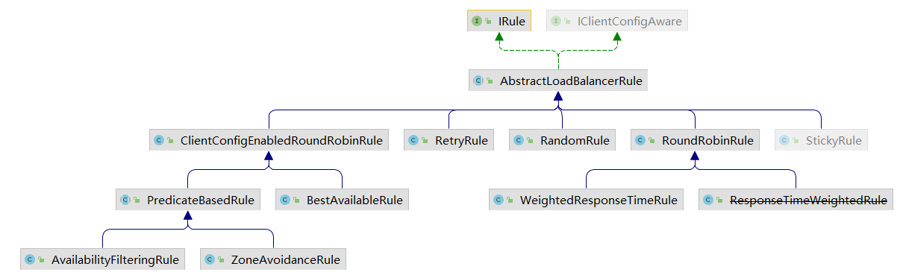
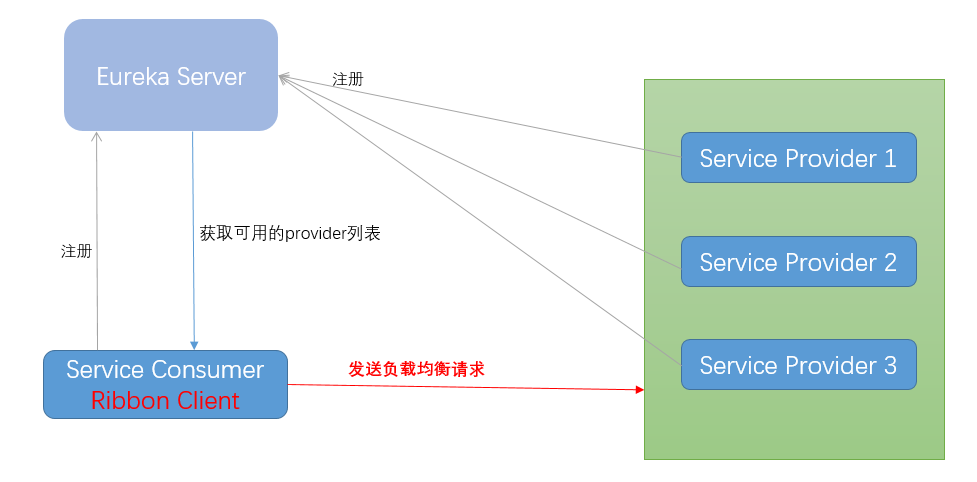
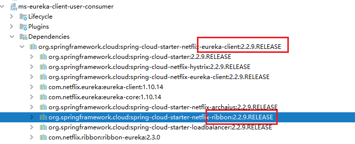
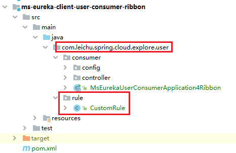

# Ribbon
Spring Cloud Ribbon是基于Netflix Ribbon实现的一套**客户端 负载均衡**的工具。

Ribbon 是 Netflix 发布的开源项目，主要功能是提供**客户端**的软件**负载均衡**算法和服务调用。

**LB负载均衡(Load Balance) 是什么？**

简单的说就是将用户的请求平摊的分配到多个服务上，从而达到系统的HA（高可用）。
常见的负载均衡有软件Nginx，LVS，硬件 F5等。

**Ribbon本地负载均衡客户端 VS Nginx服务端负载均衡区别：**
- Nginx是服务器负载均衡，客户端所有请求都会交给nginx，然后由nginx实现转发请求。即负载均衡是由服务端实现的。
- Ribbon本地负载均衡，在调用微服务接口时候，会在注册中心上获取注册信息服务列表之后缓存到JVM本地，从而在本地实现RPC远程服务调用。

**规则有哪些？**

- RoundRobinRule：轮询
- RandomRule：随机
- RetryRule：先按照RoundRobinRule的策略获取服务，如果获取服务失败则在指定时间内会进行重试，获取可用的服务
- BestAvailableRule：会先过滤掉由于多次访问故障而处于断路器跳闸状态的服务，然后选择一个并发量最小的服务
- AvailabilityFilteringRule：先过滤掉故障实例，再选择并发较小的实例
- ZoneAvoidanceRule：复合判断server所在区域的性能和server的可用性选择服务器
- WeightedResponseTimeRule：对RoundRobinRule的扩展，响应速度越快的实例选择权重越大，越容易被选择

**图解**

 
**使用**
1. pom（Eureka Client 已经内置了。无需额外引入。）


2. 配置规则
自定义配置类`com.leichu.spring.cloud.explore.user.rule`，**注意**：该配置类不能位于启动类所在的包及其子包里面。


```java
package com.leichu.spring.cloud.explore.user.rule;

import com.netflix.loadbalancer.IRule;
import com.netflix.loadbalancer.RandomRule;
import org.springframework.context.annotation.Bean;
import org.springframework.context.annotation.Configuration;

@Configuration
public class CustomRule {

	@Bean
	public IRule myRule() {
		return new RandomRule();
	}

}
```
3. 修改启动类

    加入`@RibbonClient(name = "MS-USER-PROVIDER", configuration = CustomRule.class)`
```java
@SpringBootApplication
@EnableEurekaClient
@RibbonClient(name = "MS-USER-PROVIDER", configuration = CustomRule.class)
public class MsEurekaUserConsumerApplication4Ribbon {

	public static void main(String[] args) {
		SpringApplication.run(MsEurekaUserConsumerApplication4Ribbon.class, args);
	}

}
```
4. 测试
   1. 启动 Eureka Server：MsEurekaServer7001、MsEurekaServer7002、MsEurekaServer7003
   2. 启动 user-provider：MsEurekaUserProvider8081、MsEurekaUserProvider8082、MsEurekaUserProvider8083
   3. 启动 user-consumer：MsEurekaUserConsumerApplication4Ribbon
   4. 访问：http://localhost:8080/user/1
      
