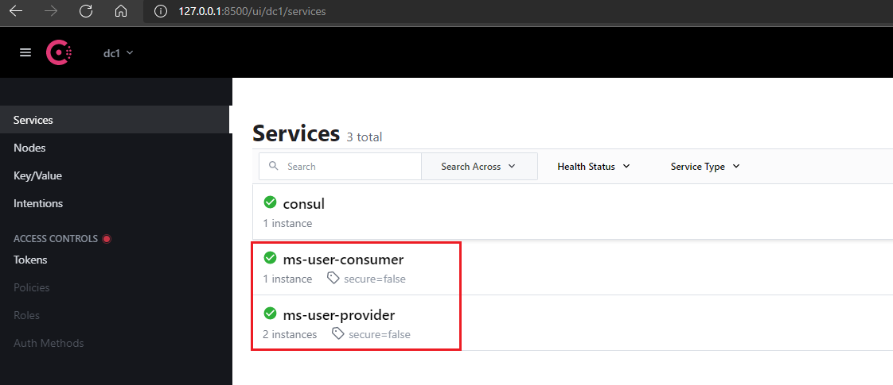

# 注册中心 - Consul

## 引入 pom 依赖
```xml
<!-- SpringBoot 整合 consul -->
<dependency>
    <groupId>org.springframework.cloud</groupId>
    <artifactId>spring-cloud-starter-consul-discovery</artifactId>
</dependency>
```
## 服务提供方 `ms-consul-user-provider`
## 服务消费方 `ms-consul-user-consumer`
## 测试


- 启动 服务消费者：8888
- 测试：http://localhost:8888/user/1
