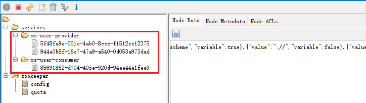

# 注册中心 - Zookeeper

## 引入 pom 依赖
```xml
<!-- SpringBoot整合zookeeper客户端 -->
<dependency>
    <groupId>org.springframework.cloud</groupId>
    <artifactId>spring-cloud-starter-zookeeper-discovery</artifactId>
</dependency>
```
## 服务提供方 `ms-zk-user-provider`
- application-replica8081.yml
```yaml
server:
    port: 8081
spring:
    application:
        name: ms-user-provider
    cloud:
        zookeeper:
            connect-string: localhost:2181
```

- application-replica8082.yml
```yaml
server:
    port: 8082
spring:
    application:
        name: ms-user-provider
    cloud:
        zookeeper:
            connect-string: localhost:2181
```
- 启动类
```java
import org.springframework.boot.SpringApplication;
import org.springframework.boot.autoconfigure.SpringBootApplication;
import org.springframework.cloud.client.discovery.EnableDiscoveryClient;

@SpringBootApplication
@EnableDiscoveryClient
public class MsZkUserProviderApplication {
	public static void main(String[] args) {
		SpringApplication.run(MsZkUserProviderApplication.class, args);
	}
}
```

## 服务消费方 `ms-zk-user-consumer`
- application.yml
```yaml
server:
    port: 8888
spring:
    application:
        name: ms-user-consumer
    cloud:
        zookeeper:
            connect-string: localhost:2181
```
- 配置类
```java
@Bean
@LoadBalanced
public RestTemplate restTemplate(){
    return new RestTemplate();
}
```
- 启动类
```java
import org.springframework.boot.SpringApplication;
import org.springframework.boot.autoconfigure.SpringBootApplication;
import org.springframework.cloud.client.discovery.EnableDiscoveryClient;

@SpringBootApplication
@EnableDiscoveryClient
public class MsZkUserConsumerApplication {

	public static void main(String[] args) {
		SpringApplication.run(MsZkUserConsumerApplication.class, args);
	}

}
```

## 测试
- 启动 Zookeeper
- 启动 服务提供者：8081 8082
- 使用 ZooInspector 连接 Zookeeper，观察 连接信息



- 启动 服务消费者：8888
- 测试：http://localhost:8888/user/1
